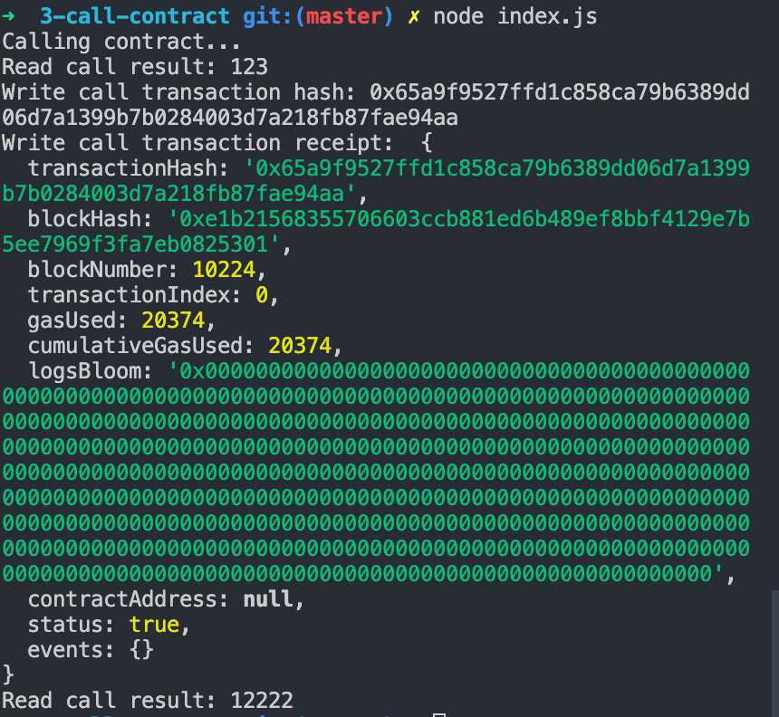

# Issue A Smart Contract Call To The Deployed Smart Contract

https://gitcoin.co/issue/nervosnetwork/grants/4/100026210

1. Smart contract call 
2. Transaction hash

```
0x65a9f9527ffd1c858ca79b6389dd06d7a1399b7b0284003d7a218fb87fae94aa
```

3. Contract address

```
0xc413013fBf437Ba31232C2bb9eFd2e05A03DfD1f
```

4. ABI

```
[
  {
    inputs: [],
    stateMutability: "payable",
    type: "constructor",
  },
  {
    inputs: [
      {
        internalType: "uint256",
        name: "x",
        type: "uint256",
      },
    ],
    name: "set",
    outputs: [],
    stateMutability: "payable",
    type: "function",
  },
  {
    inputs: [],
    name: "get",
    outputs: [
      {
        internalType: "uint256",
        name: "",
        type: "uint256",
      },
    ],
    stateMutability: "view",
    type: "function",
  },
]
```
