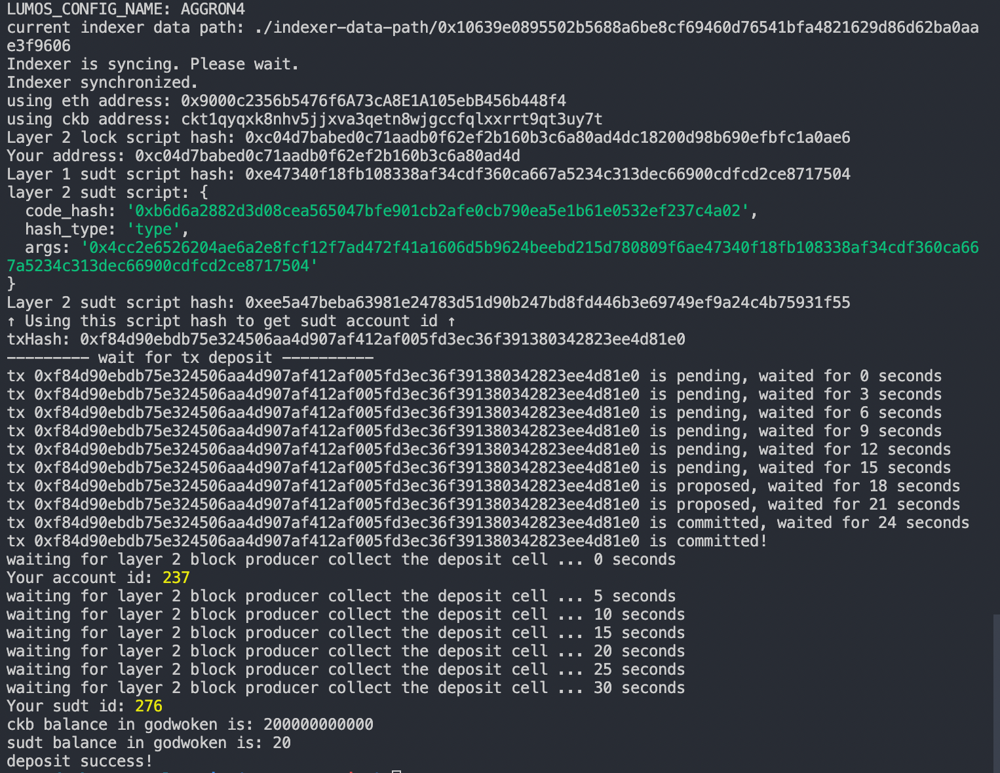

# Issue An SUDT Token On Layer 1 And Deposit It To Layer 2

https://gitcoin.co/issue/nervosnetwork/grants/5/100026211

1. Link to the Layer 1 address - https://explorer.nervos.org/aggron/address/ckt1qyqxk8nhv5jjxva3qetn8wjgccfqlxxrrt9qt3uy7t
2. Create SUDT 
3. Link to the transaction ID - https://explorer.nervos.org/aggron/transaction/0x8efad6558e722689012479e5da570eb816b72f0a67696bd9a6bc2e25f725dd46
4. Deposit Layer 2 
5. SUDT ID - `276`
