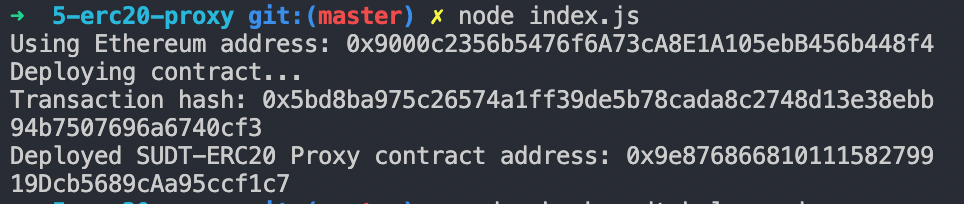

# Deploy The ERC20 Proxy Contract For The Deposited SUDT

https://gitcoin.co/issue/nervosnetwork/grants/6/100026212

1. Deploy smart contract 
2. Address of the ERC20 Proxy Contract - `0x9e87686681011158279919Dcb5689cAa95ccf1c7`
3. Check your SUDT balance 
4. Ethereum address - `0x9000c2356b5476f6A73cA8E1A105ebB456b448f4`
