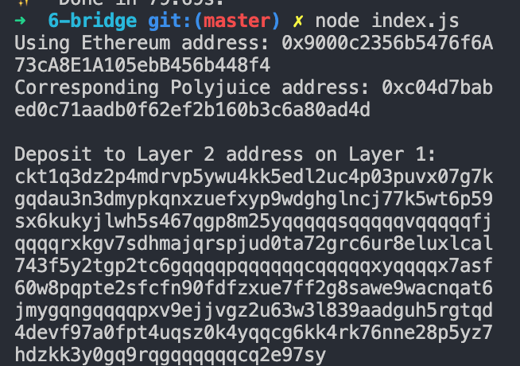

# Use Force Bridge To Deposit Tokens From Ethereum To Polyjuice

https://gitcoin.co/issue/nervosnetwork/grants/7/100026213

1. Generated your Deposit Receiver Address 
2. Deposit Receiver Address - `ckt1q3dz2p4mdrvp5ywu4kk5edl2uc4p03puvx07g7kgqdau3n3dmypkqnxzuefxyp9wdghglncj77k5wt6p59sx6kukyjlwh5s467qgp8m25yqqqqqsqqqqqvqqqqqfjqqqqrxkgv7sdhmajqrspjud0ta72grc6ur8eluxlcal743f5y2tgp2tc6gqqqqpqqqqqqcqqqqqxyqqqqx7asf60w8pqpte2sfcfn90fdfzxue7ff2g8sawe9wacnqat6jmygqngqqqqpxv9ejjvgz2u63w3l839aadguh5rgtqd4devf97a0fpt4uqsz0k4yqqcg6kk4rk76nne28p5yz7hdzkk3y0gq9rqgqqqqqqcq2e97sy`
3. Ethereum address used - `0x9000c2356b5476f6A73cA8E1A105ebB456b448f4`
4. Etherscan explorer link for the successful Force Bridge transaction - https://rinkeby.etherscan.io/tx/0x06bf3e420ff22ea90171bd4aaa3c3feee47dadf42de6c30dfeb09169b0ccca89
5. Nervos explorer for the successful Force bridge transaction - https://explorer.nervos.org/aggron/transaction/0xf4641cc456c5b89ed5456e1b79a8ed947708ae347dd79fa972301807ab283c4c
