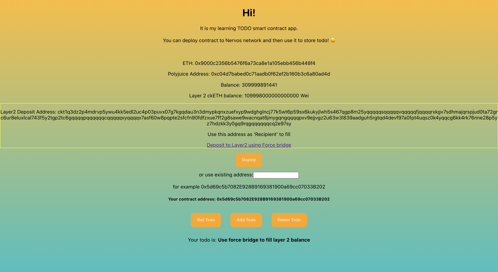

# Port An Existing Ethereum DApp To Polyjuice

https://gitcoin.co/issue/nervosnetwork/grants/8/100026214

1. App <br /> 
2. App repository - https://github.com/happylolonly/dapp-to-nervos-blockchain
3. Example smart contract - `0x5d69c5b7082E928B9169381900a69cc07033B202`, or it is possible to deploy in the app
  
  ABI:

```
[
    {
    "constant": true,
    "inputs": [
      {
        "internalType": "address",
        "name": "",
        "type": "address"
      }
    ],
    "name": "todos",
    "outputs": [
      {
        "internalType": "string",
        "name": "",
        "type": "string"
      }
    ],
    "payable": false,
    "stateMutability": "view",
    "type": "function"
  },
  {
    "constant": false,
    "inputs": [
      {
        "internalType": "string",
        "name": "todo",
        "type": "string"
      }
    ],
    "name": "addTodo",
    "outputs": [],
    "payable": false,
    "stateMutability": "nonpayable",
    "type": "function"
  },
  {
    "constant": true,
    "inputs": [],
    "name": "getTodo",
    "outputs": [
      {
        "internalType": "string",
        "name": "",
        "type": "string"
      }
    ],
    "payable": false,
    "stateMutability": "view",
    "type": "function"
  }
]
```
