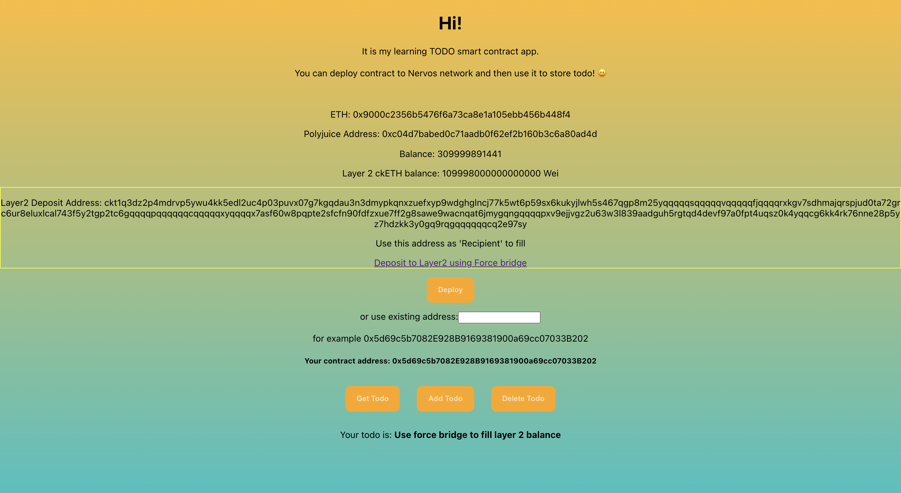

# Modify The Ported DApp So It Supports Ethereum Assets Via Force Bridge

https://gitcoin.co/issue/nervosnetwork/grants/9/100026215

1. App screenshot   
2. Address of the SUDT-ERC20 Proxy Contract - `0x88086eA40efAC60e9B7F7Fa133A84E652517Cf67`
3. Link to the GitHub repository - https://github.com/happylolonly/dapp-to-nervos-blockchain
